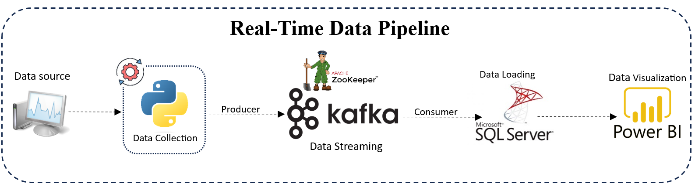
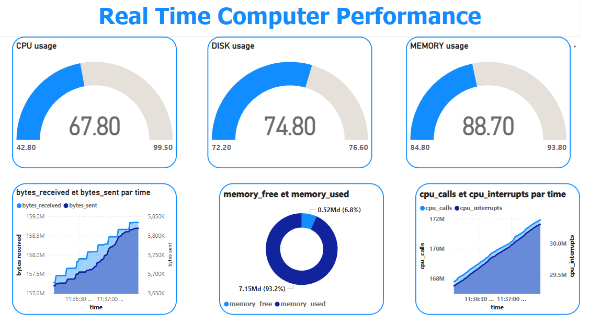

# Real-Time-Data-Pipeline-Kafka-Python-MySQL-PowerBI

This project demonstrates the implementation of a real-time data pipeline using Apache Kafka, Python's `psutil` library for system metrics collection, and SQL server for data storage. Additionally, the collected metrics are visualized using Power BI, providing real-time insights into system performance.

## Table of Contents
- [Real-Time-Data-Pipeline-Kafka-Python-SQL server -PowerBI](#real-time-data-pipeline-kafka-python-mysql-powerbi)
  - [Table of Contents](#table-of-contents)
  - [Technologies Used](#technologies-used)
  - [Architecture](#architecture)
  - [Setup Instructions](#setup-instructions)
    - [Prerequisites](#prerequisites)
    - [Kafka Setup](#kafka-setup)
    - [Dashboard Setup](#dashboard-setup)
  - [Repository Structure](#repository-structure)
  - [Contributing](#contributing)
  - [Acknowledgments](#acknowledgments)

## Technologies Used
- **Python**: Used for collecting system metrics via the `psutil` library and for interacting with Apache Kafka.
- **Apache Kafka**: A distributed streaming platform used to handle real-time data processing.
- **Apache Zookeeper**: Used for managing and coordinating Kafka brokers.
- **SQL Server**: Stored and managed the collected metrics data in a relational database.
- **Power BI**: Used to create a real-time dashboard for visualizing the metrics data.
  
## Architecture

The data pipeline involves the following steps:

1. **Data Collection**: Python's `psutil` library collects system metrics such as CPU usage, memory usage, disk usage, and network activity.
2. **Data Production**: The collected metrics data is sent to Kafka topics via a Kafka producer.
3. **Data Consumption**: Kafka consumers read the messages from Kafka topics, process them, and load the data into a MySQL database.
4. **Dashboard Visualization**: Power BI connects to the SQL server database to visualize the real-time metrics in a user-friendly dashboard.



## Setup Instructions

### Prerequisites
- Python 3.x
- Apache Kafka and Zookeeper
- SQL Server
- Power BI Desktop

### Kafka Setup
1. Install and configure Apache Kafka and Zookeeper.
2. Start Zookeeper:
   ```bash
   .\bin\windows\zookeeper-server-start.bat .\config\zookeeper.properties
   ```
3. Start Kafka server:
   ```bash
   .\bin\windows\kafka-server-start.bat .\config\server.properties
   ```
4. Create a Kafka topic:
   ```bash
   .\bin\windows\kafka-topics.bat --create --topic firstTopic --bootstrap-server localhost:9092
  
### SQL server  Database Setup
1. Create a SQL server  database named `System_Performance`.
2. Run the SQL server  script provided in `sql-scripts.sql` to create the necessary table.
3. Ensure that SQL server  is accessible for Power BI.

### Running the Pipeline
1. Install the required Python packages:
   ```bash
   pip install -r requirements.txt
   ```
2. Run `data_pipeline.py` to start collecting metrics, producing messages to Kafka, consuming messages, and inserting them into the SQL database.
   ```bash
   python data_pipeline.py
   ```

### Dashboard Setup
1. Open `dashboard_real-time.pbix` in Power BI.
2. Ensure the ODBC connection is configured correctly to connect to your SQL  server database.
3. Refresh the dashboard to visualize real-time data.


## Repository Structure

```
Real-Time-Data-Pipeline-Kafka-Python-SQL server -PowerBI/
|-- dashboard/
|   |-- real_time_computer_performance.pbix
|
|-- images/
|   |-- dashboard.png
|   |-- data_pipeline.png
|
|-- Main/
|   |-- consumer.py
|   |-- data_pipeline.py
|   |-- producer.py
|   |-- requirements.txt
|   |-- sql-scripts.sql
|
|-- README.md
```

## Contributing

Contributions are welcome! Please fork this repository and submit a pull request with your changes.

## Acknowledgments

Special thanks to the open-source communities behind Apache Kafka, Python, SQL Server, and Power BI.
